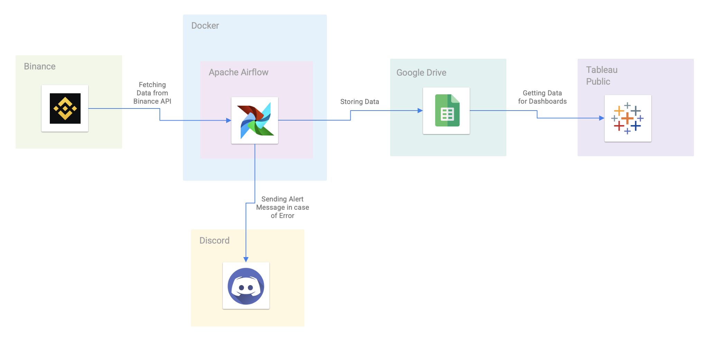

# Extracting and Visualizing Binance Data with Apache Airflow, Tableau, and Docker

This is a pet project that demonstrates how to extract and visualize Binance data using Apache Airflow, Google Sheets, Tableau, and Docker. The project is split into two parts:

1. Extracting and storing Binance data using Apache Airflow and Google Sheets
2. Visualizing Binance data using Tableau Public



[Link to the workbook](https://public.tableau.com/app/profile/aleksey3465/viz/CryptoData_16821700094820/PriceAnalysis).


## Requirements

To run this project, you'll need the following tools:

- Docker
- Docker Compose

## Getting Started

To get started, clone this repository to your local machine:

```
https://github.com/rezaprimasatya/crypto-data-pipeline
```


Once you've cloned the repository, navigate to the project directory and start the Docker containers:

```
cd crypto-data-pipeline
docker-compose up --build
```


The `docker-compose up --build` command will start the following containers:

- `git-sync`: This container syncs the code with the Git repository
- `airflow-database`: This container runs a PostgreSQL database for Apache Airflow
- `airflow`: This container runs Apache Airflow and executes the DAG

You can access the Apache Airflow UI at `http://localhost:8080`. Use the following credentials to log in:

- Username: `airflow`
- Password: `w0lfr1a`
